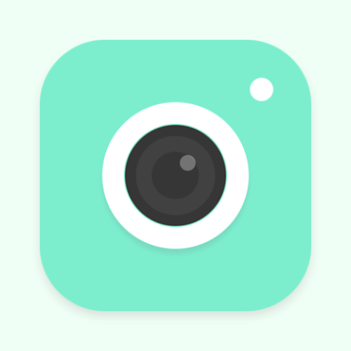

  

# Simple Camera App with Image Gallery
**Simple Camera App** is a sample Android application 📱 built to demonstrate use of Camera1 & Google Drive Api. It help Android developers easily integrate Camera features.

***You can Install and test latest Camera app from below 👇***.

https://github.com/SharadTawde/Camera-App-With-Image-Gallery/raw/master/app-debug.apk

# ScreenShots

<table style="width:100%">
  <tr>
    <th>Main Screen</th>
    <th>Focus mode</th>
    <th>Image gallery</th>
    <th>Google drive option</th>
  </tr>
  <tr>
    <th></th>
    <th></th>
    <th></th>
    <th></th>
  </tr>
</table>

## Features
- Capture image with high resolution. 
- On touch focus mode.
- Rotate camera.
- Gallery view for captured images.
- View full screen image.
- Upload to google drive
